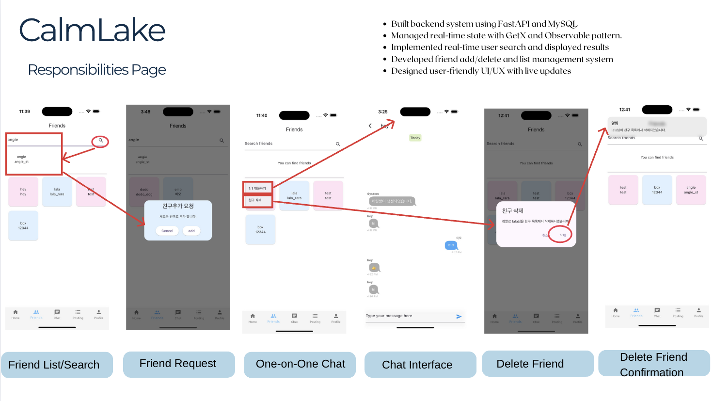

# CalmLake

---

## Table of Contents

- [Overview](#overview)
- [Demo Video](#demo-video)
- [Features](#features)
- [My Roles & Responsibilities](#my-roles--responsibilities)
- [Tech Stack](#tech-stack)
- [Main Packages](#main-packages)
- [System Architecture](#system-architecture)
- [Database](#database)
- [Screen Flow Diagram](#screen-flow-diagram)
- [Screenshots](#screenshots)
- [How to Run](#how-to-run)
- [Contact](#contact)

---

## Overview

CalmLake is a Flutter-based mobile app that provides a space for users to relieve stress by enjoying healing music and communicating with others.  
Key features include music appreciation, social interaction, real-time chat, and friend management.

- **Team Size:** 4 members  
- **Project Duration:** October 2, 2024 – October 17, 2024

---

## Demo Video

**Links:**  
- [Demo Video](https://youtu.be/zySfBs3fqRo)

---

## Features

- Real-time private chat and open chat rooms
- User search and friend management (add/delete/search)
- Music appreciation and sharing
- Backend powered by FastAPI & MySQL, with Firebase for chat and storage

---

## My Roles & Responsibilities

- Implemented real-time private chat functionality
- Developed open chat rooms for multiple users
- Built user search and friend management system (add/delete features)
- Integrated backend routing and APIs using FastAPI
- Designed and implemented UI/UX for friend and chat features
- Managed real-time state with GetX and Observer pattern

---

## Tech Stack

**Frameworks:**  

**Languages:**  

**Database:**  

- **EER Diagram only is provided for MySQL.**

**Design/Planning:**  

**Tools:**  

---

## Main Packages

- `get`: State management
- `http`: HTTP requests
- `get_storage`: Local storage
- `flutter_slidable`: Swipeable list items
- `image_picker`: Image selection from gallery/camera
- `firebase_core`, `cloud_firestore`, `firebase_storage`: Firebase integration
- `audioplayers`: Audio playback
- `intl`: Date/time formatting
- `flutter_rating_bar`: Rating bar widget
- `lottie`: Lottie animation
- `chat_bubbles`: Chat UI widgets
- `volume_controller`: System volume control
- `file_picker`: File selection widget
- `gif`: GIF image handling
- `expandable_text`: Expandable text widget

---

## System Architecture

---

## Database

### MySQL EER Diagram  
_Only the EER diagram is provided; actual database dump is not included._

### Firebase Structure  

---

## Screen Flow Diagram

---

## Screenshots

### Main Screenshots (Features I Developed)

---

## How to Run

1. Clone the repository  
   `git clone https://github.com/terryhyuk/calmlake.git`
2. Install dependencies  
   `flutter pub get`
3. Run the app  
   `flutter run`
4. Backend setup required for full functionality:
   - The backend (FastAPI) source code is in the `/pythonSpace` directory.
   - To run the backend:
     1. Open a terminal and go to the `pythonSpace` folder.
     2. (Optional) Create a virtual environment:
        `python3 -m venv venv`
        `source venv/bin/activate`
     3. Install dependencies:
        `pip install -r requirements.txt`
     4. Start the FastAPI server:
        `uvicorn calmlake:app --reload`
   - The Flutter app uses Firebase directly; there is **no separate Firebase folder**.  
     Make sure your Firebase project is set up and configured in your Flutter app as described in the Flutter/Firebase documentation.

---

## Contact

For questions, contact:  
**Terry Yoon**  
yonghyuk.terry.yoon@gmail.com
